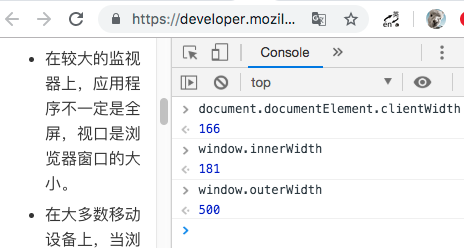
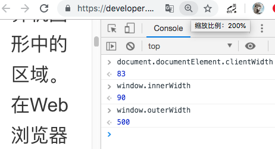

[TOC]

# Web 开发中的 viewport 与移动端适配

## 1. 引言

移动端开发中，有一个躲避不掉的 HTML meta 声明 `<meta name="viewport">`。通常被用来做跨屏适配，常见声明如下：

```html
<meta
  name="viewport"
  content="width=device-width,initial-scale=1,user-scalable=no"
/>
```

这个声明中隐含的概念和历史，以及如何更合理的搭配 `px/rem/vw` 来做跨屏适配，我们接下来一起探讨一下。

## 2. viewport 简述

### 2.1 viewport 概念

`viewport` 中文译作“视口”。[维基百科的解释](https://en.wikipedia.org/wiki/Viewport)为：

> - 在计算机图形学理论中，当将一些对象渲染到图像时，存在两个类似区域的相关概念。(视口和窗口)
> - 视口是一个以特定于渲染设备的坐标表示的区域（通常为矩形）。视口范围内的图像会以剪切的形式，投影到到世界坐标窗口中，完成图像的可视化展示。
> - 在 Web 浏览器中，视口是整个文档的可见部分。如果文档大于视口，则用户可以通过滚动来移动视口。

白话描述一下，计算机把图像渲染到显示器的过程中，会先创建一个逻辑层的画布，然后从这个画布中框选一部分，将其投影到显示层。这个选框就是`视口`，显示层就是`窗口`。

截一张某宝的商品放大的效果图，来做更形象的视口解释。

如图，左半图为计算机里的看不到的逻辑画布，上方半透明选框为视口(viewport)，右半图为窗口，即用户看到的部分。

逻辑关系简单清晰。

此处插入一个问题：浏览器中，对页面进行放大的时候，视口的大小如何变化？

### 2.2 viewport 的缩放与平移

回答 2.1 中的问题，视口会变小。

因为，浏览器窗口中所浏览图像的放大，是依赖于视口的缩小来实现的。

参考 2.1 中插图来理解，右侧浏览器窗口不变的情况下，左侧视口缩小到只能覆盖模特的面部时，右侧窗口中的图像就会放大到满屏都是大头像了。

同理，在浏览器窗口中，当我们想看到模特的小腿时，我们需要向下滚动滚动条，浏览器在实现这个的过程中所依赖的，便是视口的下移。

### 2.3 viewport 的 DOM API

关于上面的解释，我们来验证一下。

目前已被标准实现的 API 中，有两个 DOM 属性可以用来获取视口的大小。

以宽度为例：

- document.documentElement.clientWidth（不含滚动条）
- window.innerWidth（含滚动条）


如图，PC Chrome 中试验，确实如之前解释，放大到 200%后，视口大小缩小了一倍。（小数点默认四舍五入了）

### 2.4 Visual Viewport 和 Layout Viewport

在 [MDN 对 vieport 的解释](https://developer.mozilla.org/en-US/docs/Glossary/viewport)中

> - 视口表示当前正在查看的计算机图形中的多边形（通常为矩形）区域。在 Web 浏览器术语中，它指的是您正在查看的文档中当前`可在其窗口中显示的部分`（如果以全屏模式查看文档，则指的是屏幕）。在滚动到视图中之前，视口外部的内容在屏幕上不可见。
>
> - 当前可见的视口部分称为可视视口。这可以小于布局视口，例如当用户进行缩放缩放时。该布局视口保持不变，但视觉视口变小。

引入了新的概念——`Visual Viewport`和`Layout Viewport`，即可视视口和布局视口。

_注：有的文章将 Visual Viewport 译作“视觉视口”，个人认为其语义感不如“可视视口”。_

我们上面一直描述的视口，即为此处的“可视视口”——**可**在窗口中显示的区域。而“布局视口”则指的就是 2.1 白话描述中的画布。

_有人针对这两个概念做了一个 demo，参见：http://bokand.github.io/viewport/index.html_

下面如果不做特别说明，视口，依然指的是“可视视口”。

## 3. 移动端的 viewport

看起来 viewport 并没有太多复杂之处，但是 2012 年左右，移动端时代来了。

### 3.1 放大的 viewport

移动互联网的早期，屏幕设备的物理像素点宽度多数在 320、480、640 等。如果浏览器和针对 PC 制作的网页都不做任何处理，那么在窄屏设备上加载网页，我们看到的效果便是默认显示网页的左上角部分，然后通过水平和竖直方向的滚动来浏览网页的其他部分。

_注：移动设备的显著特点是屏幕小，考虑到国际社会通行的水平阅读习惯，我们这里只讨论宽度。_

首先，我们看不到网页全局的样子。其次，我们需要通过不断的滚动来保证阅读内容的连续性。这样的体验，有点过于糟糕了。

为了优化“最初为 PC 设计的网页”在移动设备的浏览体验，移动浏览器厂商们想了一个方案，那就是增大页面载入时初始视口的宽度，比如 980px。

按照 2.1 里的 viewport 的解释，如此的设计，会把逻辑层画布中 980px 的图像投影显示到 320px 的屏幕上，看到的效果便是一个挤在一起的缩小版的页面。


如上图，页面载入时，我们可以一眼看到整个页面的样子了。
不过，对缩小版页面内细节内容的浏览，依然要依靠放大和滚动，这样的体验依然不够好。而且如果 PC 网页的 CSS 宽度大于 980px，那么初始页面依然会有滚动条。

### 3.2 定制 viewport

对于使用媒体查询技术(Media queries)对窄屏进行优化的页面，3.1 所述的方案显得更加不合理了。因为，如果视口宽度初始为 980px，那么浏览器便不会以 640px、480px 或更低分辨率来启动对应的媒体查询，从而限制了这类查询机制的有效性。

为了解决这个问题，Apple 在 iOS Safari 中首先引入了`viewport meta tag`，允许 Web 开发人员[定制视口](https://developer.apple.com/library/archive/documentation/AppleApplications/Reference/SafariWebContent/UsingtheViewport/UsingtheViewport.html)的大小和比例（约 2014 年）。

虽然，后续其他的移动浏览器也都支持了此标记，但是 W3C 并未将此列入标准。（这并不影响我们使用它）

_从目前 W3C 的草案规范来看，他希望按如下方式在 css 中声明 viewport，而不是在\<meta\>中。_

```css
@viewport {
  width: device-width;
}
```

_W3C 草案中的获取视口宽度 API 为：_

```javascript
window.visualViewport.width;
```

_更多相关细节，可以参考下面链接，本文不作更多讨论。_

> 参考：
>
> - https://drafts.csswg.org/css-device-adapt/#the-viewport
> - https://developer.mozilla.org/en-US/docs/Web/CSS/@viewport
> - https://developer.mozilla.org/en-US/docs/Web/API/VisualViewport

## 4. Viewport Meta Tag 的使用

由 iOS 的 Safari 率先引入的`Viewport Meta Tag`声明，在 2014 年左右就被各大主流移动浏览器厂商所支持，我们可以在 Apple 或者 MDN 的开发者文档中查看具体用法说明。

需要注意的一点是，目前**只有移动端的浏览器**支持这一声明方式，**PC 上是无效的**。

_在那些难以界定移动还是 PC 的设备中，这种区分可能会存在一些问题，有一些 Web 组织，如 WICG(Web Platform Incubator Community Group)目前在尝试推动解决这个问题。这里不做更多讨论。（参考：https://github.com/WICG/visual-viewport）_

### 4.1 viewport 属性取值

`<meta name="viewport">`支持多个属性取值，如下表：

| Value         | Possible subvalues             | Description                                                                     |
| ------------- | ------------------------------ | ------------------------------------------------------------------------------- |
| width         | 正整数或者字符串 device-width  | 视口宽度(px)。                                                                  |
| height        | 正整数或者字符串 device-height | 视口高度(px)。                                                                  |
| initial-scale | 正数                           | 设备宽度(device-width)与视口宽度的初始缩放比值。                                |
| maximum-scale | 正数                           | 缩放的最大值；它必须大于或等于 minimum-scale 的值，不然会导致不确定的行为发生。 |
| minimum-scale | 正数                           | 缩放的最小值；它必须小于或等于 maximum-scale 的值，不然会导致不确定的行为发生。 |
| user-scalable | yes/no                         | 是否允许用户缩放。默认值为  yes。                                               |

### 4.2 viewport 属性举例

我们以`iPhone6s`手机+`Safari`浏览器举例，对上述属性做详细说明。如未做特殊说明，均**只讨论竖屏模式**。

设备参数说明：

- 操作系统：iOS 12.3.1
- 屏幕物理分辨率：750\*1334
- 屏幕逻辑分辨率：375\*667 (screen.width/height)
- 设备像素比(dpr)：2 (window.devicePixelRatio)
- 浏览器默认视口宽度：980 (window.innerWidth)

> 关于 dpr
>
> 大家常说的两倍屏、三倍屏，这里面的倍数指的就是 dpr，即单一方向上，设备像素的点数/逻辑像素的点数。
>
> - Web 开发中操作的 px，指的是逻辑像素。由于现代手机屏幕物理发光点的排布越来越密集，逻辑上的 1px 也并非对应屏幕上的 1 个发光点。两倍屏的 1px 对应的是 2\*2=4 个物理点。
> - 移动设备厂商，根据自己的屏幕像素密度，设定了一个 dpr，以便相同数量的逻辑像素在物理世界看起来的大小差不多。以 iPhone6s 举例，59mm 的屏幕宽度上排布了 750 个发光点，如果 dpr 为 1，那换算下来，PC 视觉上比较舒服的 14px 宽的字体，在手机上显示的物理宽度为 59/750\*14=1.1mm，完全看不见的。
> - 至于，为什么 iPhone6S 的 dpr 选择了 2 而不是 2.5 或者 3，这里不做具体讨论了。

#### 4.2.1 width

```html
<meta name="viewport" content="width=1000" />
```

- window.innerWidth 输出 1000
- div 宽度 1000px 时，横向刚好铺满屏幕，超过出现横向滚动条

```html
<meta name="viewport" content="width=device-width" />
```

- window.innerWidth 输出 375
- div 宽度 375px 时，横向刚好铺满屏幕，超过出现横向滚动条

```
多数移动端viewport相关的文章，都推荐设置视口宽度"width=device-width"，<br>
因为这样可以利用移动设备厂商调校好的dpr，使得同一大小的逻辑像素描述，在物理世界的不同屏幕上都能显示得大小刚刚好。<br>
描述待整理。。。
```

#### 4.2.2 initial-scale

```html
<meta name="viewport" content="initial-scale=1" />
```

- 同 width=device-width

```html
<meta name="viewport" content="initial-scale=2" />
```

- window.innerWidth 输出 188 (375/2)
- div 宽度 188px 时，横向刚好铺满屏幕，超过出现横向滚动条

此处插入一个问题：
不做任何 viewport 设置情况下，默认 initial-scale 的值为多少？

#### 4.2.3 maximum-scale / minimum-scale

```html
<meta
  name="viewport"
  content="initial-scale=2,minimum-scale=1,maximum-scale=3"
/>
```

预期页面初始 1 倍，最小可以缩小到 0.5 倍，最大放大到 2 倍。但是实际表现并非如此：

- 小米 9 的系统浏览器表现符合预期
- iOS 中 所有 Web 容器均无法缩放 到 比 initial-scale 更小的倍数，即使 minimum-scale 声明了一个更小且合理的取值
- iOS 微信(7.0.5)的 webview 中，遵守了最大 3 倍声明，但 Safari 可以放大到比 3 倍更高的倍数

_iOS10 开始，为了提高网页在 Safari 中的可访问性，Safari 限制了最小倍数(minimum-scale)并忽略了 最大倍数(maximum-scale) 的声明_

Android 和 iOS 在不同版本不同厂商的 Web 容器中，缩放相关属性的表现可能存在较大程度的不一致，请谨慎使用。

#### 4.2.4 user-scalable

```html
<meta name="viewport" content="user-scalable=no" />
```

- Safari 中依然无法缩小可以放大，微信中无法缩放
- Android 未做测试

同 4.2.3，缩放相关属性存在兼容问题，请谨慎使用

#### 4.2.5 width 和 initial-scale 的取值冲突

```
首先回答一下 4.2.2 中的问题，默认情况下视口的宽度为 980px，设备宽度(device-width)为 375，所以，默认的 initial-scale 为 375/980= 0.38265
```

同理，"width=device-width" 和 "initial-scale=1" 也是等效的。（device-width 对应数值在竖屏模式下为 375，横屏模式下为 667）

既然，两个属性的作用都是设置初始视口大小，那同时设置且存在冲突的情况下，浏览器会怎么处理呢？优先级规则是按书写顺序还是宽度大小？比如下面这样：

```html
<meta name="viewport" content="width=device-width,initial-scale=2" />
```

Safari 的运行结果是"initial-scale"的优先级更高，但是这样的对比研究**并没有任何意义**。因为并没有相应的规范约束这件事情，浏览器的兼容表现肯定是千差万别。

作为开发者，我们要做的，就是避免冲突。要么只写一个，要么两个都计算正确。从语义表达角度看，**建议只设置"width"**。

## 5. 多屏适配方案中的 viewport

### 5.1 常见适配需求/方案

多屏适配的需求，常见有两类：

1. 响应式（布局伸缩或流动，文字图片等内容梯级缩放）
2. 缩放式（布局和内容完全等比例缩放）

_注：也可以说还有第三种，就是以上两种方式的组合，这里不做更多讨论_

对应的技术方案一般也是对视口(viewport)、媒体查询(media queries)、单位(px/%/rem/vw)的组合使用。

#### 5.1.1 响应式适配

响应式适配需求，可以说是一套代码需要适配所有大小的屏幕，常见于 PC 和移动端共用一套代码的场景。这类需求在移动互联网的早期比较流行，典型的 Web 站点如[BootStrap](http://bootstrap.evget.com/getting-started.html)。浏览这类站点时，随着屏幕的缩小，你会看到页面模块的布局结构、主体内容的大小一直在做梯级变化。

其技术方案方案一般是：

- 设置 viewport 宽度为 device-width 以实现同样 px 大小约束下不同屏幕视觉大小的一致性
- 布局容器的宽度使用`%`以实现伸缩
- 定位排列使用`float/flex/inline-block`等以实现流动
- 使用媒体查询按照一定的梯级范围给各种屏幕定制页面模块的布局、字号图片的大小，以实现视觉上舒适的梯级变化

注：
请注意区分媒体查询中的`min-device-width`和`min-width`，前者依据的是设备宽度(screen.width)，后者依据的是视口宽度(window.innerWidth)。

#### 5.1.2 缩放式适配

缩放式适配需求，即按照屏幕宽度，在不同的屏幕上满屏等比例缩放展示。简单描述，就像一张固定长宽比，且横向总是铺满屏幕的图片，大屏显示的大，小屏显示的小。

移动互联网发展到一定阶段之后，越来越多的开发者意识到响应式适配的复杂性和局限性，开始针对特定屏幕设计固定的 UI，绝大多数数移动端产品都有了区分于 PC 的专门的`m站`。

这类业务场景中，运行环境都是便携式的手机，屏幕宽度差距都不大，UI 适配上，可以一把梭只做缩放式适配了。

其**早期技术方案**一般是：

- 设置 viewport 宽度为 device-width 或其他固定值 (可选项)
- css 单位使用 rem，js 根据 screen.width 以及 css 中 rem 的换算系数，动态计算并设置 html 根节点 font-size，以实现整个页面内容的等比例缩放

_github 中近 1 万 star 的 js 库`amfe-flexible`便是采用的此方案。_
注：这个方案解决 1px 细线的方案是？
https://www.w3cplus.com/mobile/lib-flexible-for-html5-layout.html

```javascript
if (dpr >= 2) {
  var fakeBody = document.createElement("body");
  var testElement = document.createElement("div");
  testElement.style.border = ".5px solid transparent";
  fakeBody.appendChild(testElement);
  docEl.appendChild(fakeBody);
  if (testElement.offsetHeight === 1) {
    docEl.classList.add("hairlines");
  }
  docEl.removeChild(fakeBody);
}
```

这个方案中有两个常见问题：

1. dpr>1 的屏幕，如何实现 1px 细线
2. 如何避免 rem 单位取值为多位小数点时，不同浏览器表现出的渲染差异

这两个问题引出了两个关键点：

- viewport 的 width 的最优值是多少？
- css 的 rem 书写转换系数的最优值是多少？

继续抛出一个问题：
rem 方案中，不考虑 1px 细线问题的话，是否可以不设置 viewport？

**后期技术方案**

vw/vh/vmin/vmax

待整理。。

---

---

# 下为草稿

视口和窗口

viewport 中文译作“视口”，即可视区域，详细讲就是浏览器窗口中用来展示 Web 内容的区域。
和“窗口”（window）做对比，在浏览器全屏状态下，两者大小是相等的。但是因为浏览器中标题栏/状态栏/地址栏/滚动条/控制台等其他 UI 元素的存在，视口的大小绝大多数情况下是小于窗口大小的。


如图，以宽度举例：

- 视口宽度(document.documentElement.clientWidth)
- 窗口内部宽度(window.innerWidth) = 视口宽度+滚动条宽度
- 窗口外部宽度(window.outerWidth) = 窗口内部宽度+控制台宽度+边框宽度

逻辑关系简单清晰。
鉴于 Web 开发都是容器内的操作，我们通常并不关心浏览器的窗口宽度。下面，我们只讨论“视口”。

这里插入 问题 1：
在浏览器内对页面进行缩放操作，放大到 200%，视口宽度的值会如何变化？

### 视口与文档缩放


如图，实际结果是：视口宽度由 166 缩小一倍到了 83。

放大一倍之后，页面大小 x2，可视区域的大小并没有变，为什么取到的视口宽度值缩小了一倍？

解释如此诡异的现象，需要引入新的概念——“可视视口(Visual Viewport)”和“布局视口(Layout Viewport )”。

### 视觉视口和布局视口

参考 1 https://developer.mozilla.org/en-US/docs/Web/CSS/Viewport_concepts
参考 2 https://developer.mozilla.org/zh-CN/docs/Web/HTML/Element/meta

待继续整理

- HTML `<head>`中的一个`<meta>`声明，用来告诉浏览器`初始视口`的大小，仅供移动设备使用。常见如下：

```html
<meta
  name="viewport"
  content="width=device-width,initial-scale=1,user-scalable=no"
/>
```

- 告诉浏览器，按满屏多少宽度来渲染（逻辑像素）。
  > 逻辑像素：css 中声明的 px 值

## 2.历史背景和作用

ppk 的三个视口 逻辑太麻烦 其实就是个逻辑容器和物理容器

- 34w 阅读 https://www.cnblogs.com/2050/p/3877280.html
- ppk 2014 viewport 的研究 https://www.quirksmode.org/mobile/metaviewport/
- 最早推出 meta viewport 的 Apple https://developer.apple.com/library/archive/documentation/AppleApplications/Reference/SafariHTMLRef/Articles/MetaTags.html
- CSS W3C 草案 https://drafts.csswg.org/css-device-adapt/
- 2019 标准权利移交之后的文档？ MDN 的文档？

以上都有点老了,还是参考 MDN 吧 https://developer.mozilla.org/zh-CN/docs/Web/HTML/Element/meta

获取容器逻辑宽度
document.documentElement.clientWidth

而元视窗指令被称为 initial-scale，minimum-scale 和 maximum-scale。其他浏览器被迫遵守以保持与 iPhone 特定网站的兼容性。

可以研究下 height
视觉宽度获取 visual viewport 的宽度可以通过 window.innerWidth

遗憾的是，历史上许多文档都是针对较大的视口设计的，并且在较小的视口中查看时会出现各种错误。这些包括非预期的布局包装，剪切的内容，笨拙的可滚动边界和脚本错误。为了避免这些问题，移动浏览器通常使用固定的初始包含块宽度来模仿常见的桌面浏览器窗口大小（通常为 980-1024px）。然后缩小生成的布局以适应可用的屏幕空间。

CSS 标准草案中提出了“使用@viewport 规则覆盖网页中视口大小”的标准方法，来替换从 Apple 流行起来的`<meta vieport>`实现，示例如下：

```css
@viewport {
  width: device-width;
}
```

然，截止 2019 年 8 月，主流浏览器均未提供实现。我们先忽略这个。

## 3. width 和 scale

`content`属性的取值，常用有两个：

- width
- scale
  表达的是同一个意思。

### 2.1 width

支持两种取值：

- device-width
- 具体 number 值（如 750）

initial-scale 和 width 的优先级？取大的 ？是书写顺序在后面的？
应该怎样呢
