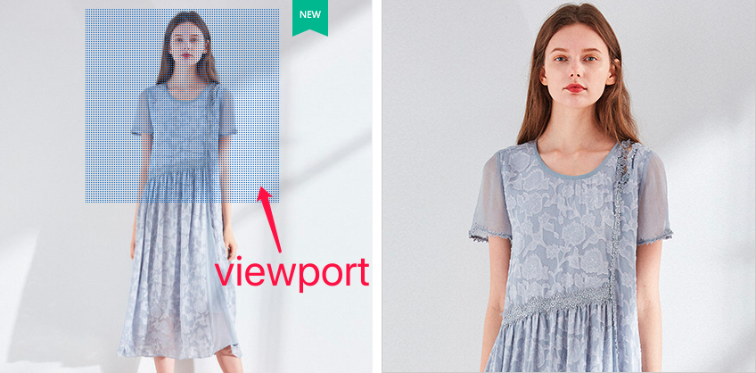
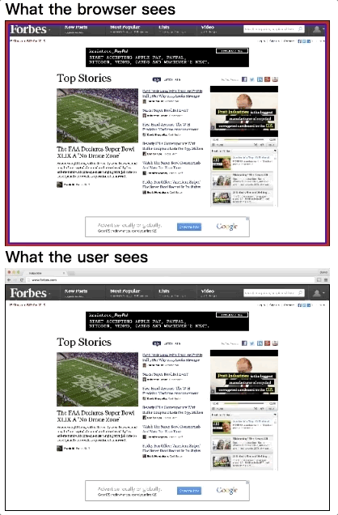
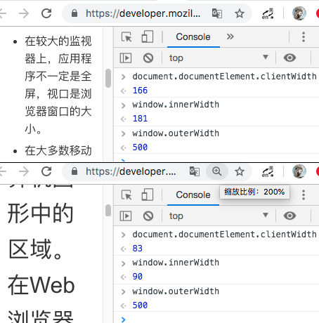
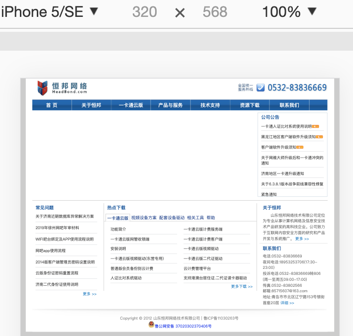
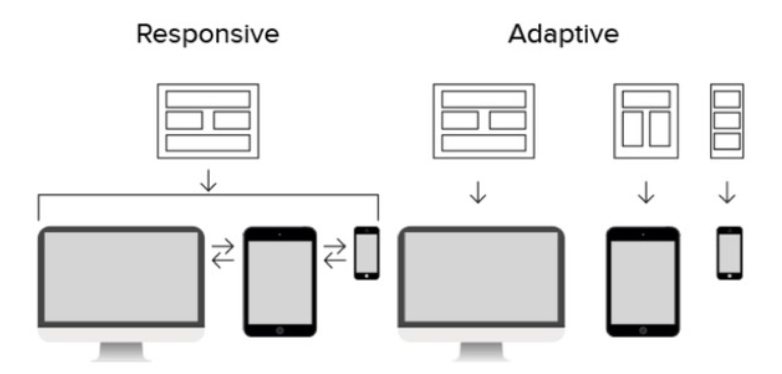
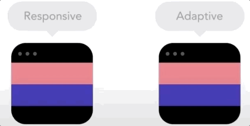
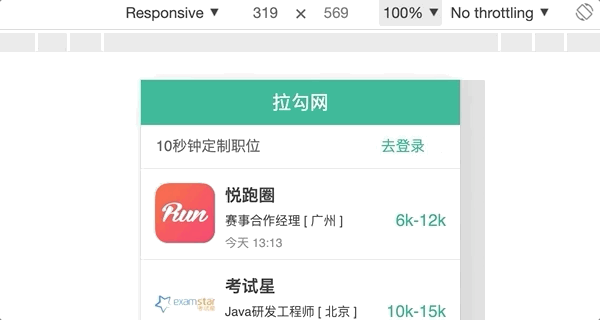

[TOC]

# Web 开发中的 viewport 与移动端适配

摘要：解释 viewport 的一切

## 1. 引言

移动端开发中，有一个躲避不掉的 HTML meta 声明 `<meta name="viewport">`。通常被用来做跨屏适配，常见声明如下：

```html
<meta
  name="viewport"
  content="width=device-width,initial-scale=1,user-scalable=no"
/>
```

这个声明中隐含的概念、历史和未来，以及如何更合理的搭配 `px/rem/vw` 来做跨屏适配，我们接下来一起探讨一下。

本文关键词：移动端适配、Viewport、Viewport Meta Tag、DPR、响应式、自适应、Viewport Units

## 2. viewport 名词解释

_视口概念的正确理解是本文所述内容的基础，请认真阅读本章节。_

### 2.1 viewport 概念

`viewport` 中文译作“视口”。

维基百科的解释为：

> - 在计算机图形学理论中，当将一些对象渲染到图像时，存在两个类似区域的相关概念。(视口和窗口)
> - 视口是一个以特定于渲染设备的坐标表示的区域（通常为矩形）。**视口范围内的图像会以剪切的形式**，**投影到**到世界坐标**窗口中**，完成图像的可视化展示。
> - 在 Web 浏览器中，视口是整个文档的可见部分。如果文档大于视口，则用户可以通过滚动来移动视口。

_参考：https://en.wikipedia.org/wiki/Viewport_

白话描述一下：

- 计算机把图像渲染到显示器的过程中，会先把图像画在一个逻辑层的画布上，然后从这个画布中框选一部分，将其投影到显示层。
- 这个选框就是`视口`，显示层就是`窗口`。
- 在浏览器中，我们可以通过滚动条来移动视口以看到更多网页内容。

更形象的视口解释：


如这张某宝的商品放大效果图，左半图为计算机看到的逻辑层画布，上方半透明选框为视口(viewport)，右半图为浏览器窗口，即用户看到的部分。

逻辑关系简单清晰。

**此处插入一个问题：**

浏览器中，对页面进行放大的时候，视口的大小如何变化？

### 2.2 viewport 的缩放与平移

回答 2.1 中的问题，视口会变小。

因为，浏览器窗口中所浏览图像的放大，是依赖于视口的缩小来实现的。

如果不好理解，可以参照下图动画来感受一下。（上面蓝框表示底层画布、红框表示视口，下面表示用户在浏览器窗口中看到的页面）



同理，当浏览器窗口比较小，而我们想要看到页面下面的内容时，我们需要向下滚动滚动条，浏览器在实现这个的过程中所依赖的，便是视口的下移。

### 2.3 viewport 的 DOM API

关于上面的解释，我们来验证一下。

目前已被标准实现的 API 中，有两个 DOM 属性可以用来获取视口的大小。

以宽度为例：

- document.documentElement.clientWidth（不含滚动条）
- ~~window.innerWidth（含滚动条）~~



如图，PC Chrome 中试验，确实如之前解释，放大到 200%后，视口大小缩小了一倍。（小数点默认四舍五入了）

**注意：**

在移动端的浏览器中，对页面手动捏合做缩放时，`document.documentElement.clientWidth` 不会有任何变化。`window.innerWidth`在 iOS 中会等比例缩小，在 Android 的不同浏览器中表现差异较大。

如果有需要获取视口宽度的需求，建议使用`document.documentElement.clientWidth`，至少在用户为做任何手动缩放的前提下，其取值是正确的。

### 2.4 Visual Viewport 和 Layout Viewport

MDN 对 viewport 的解释中引入了新的概念——`Visual Viewport`和`Layout Viewport`，即可视视口和布局视口。

_参考：https://developer.mozilla.org/en-US/docs/Glossary/viewport_

> - 视口表示当前正在查看的计算机图形中的多边形（通常为矩形）区域。
> - 在 Web 浏览器术语中，它指的是您正在查看的文档中当前`可在其窗口中显示的部分`（如果以全屏模式查看文档，则指的是屏幕）。在滚动到视图中之前，视口外部的内容在屏幕上不可见。
>
> - 当前可见的视口部分称为可视视口。这可以小于布局视口，例如当用户进行缩放缩放时。该布局视口保持不变，但视觉视口变小。

_注：有的文章将 Visual Viewport 译作“视觉视口”，个人认为其语义感不如“可视视口”。_

我们在 2.1 中一直描述的“视口”，即为此处的“可视视口”（**可**在窗口中显示的区域）。2.1 中所说的“画布”指的就是此处的“布局视口”。

~~网上流传较广的一些文章中，把视口分了三种——布局视口、可视视口、理想视口。~~ 个人认为概念太多了反而会增加理解成本。

下面如果不做特别说明，“可视视口”我们依然称为“视口”。

## 3. 移动端的 viewport

看起来 viewport 并没有太多复杂之处，但是 2012 年左右，移动端时代来了。

### 3.1 放大的 viewport

移动互联网的早期，屏幕设备的物理像素点宽度多数在 320、480、640 等。如果浏览器和针对 PC 制作的网页都不做任何处理，那么在窄屏设备上加载网页，我们看到的效果便是默认显示网页的左上角部分，然后通过水平和竖直方向的滚动来浏览网页的其他部分。

_注：移动设备的显著特点是屏幕小，考虑到国际社会通行的水平阅读习惯，我们这里只讨论宽度。_

首先，我们看不到网页全局的样子。其次，我们需要通过不断的滚动来保证阅读内容的连续性。这样的体验，有点过于糟糕了。

为了优化“最初为 PC 设计的网页”在移动设备的浏览体验，移动浏览器厂商们想了一个方案，那就是增大页面载入时初始视口的宽度，比如 980px。

按照 2.1 里的 viewport 的解释，如此的设计，会把逻辑层画布中 980px 的图像投影显示到 320px 的屏幕上，看到的效果便是一个挤在一起看不清楚细节的缩小版页面。


如上图，页面载入时，我们可以一眼看到整个页面的样子了。

不过，该方案依然会有很多问题：

- 对缩小版页面内细节内容的浏览，依然要依靠放大和滚动，体验不好
- 如果 PC 网页的 CSS 宽度描述大于 980px，那么初始页面依然会有滚动条
- 限制了针对视口宽度做媒体查询(Media queries)机制的有效性，因为视口宽度初始为 980px，浏览器不会以 640px、480px 或更低分辨率来启动对应的媒体查询

_注：媒体查询请注意区分`@media screen and (xxx){}`中的`min-device-width`和`min-width`，前者依据的是设备宽度(screen.width)，后者依据的是视口宽度(window.innerWidth)。_

### 3.2 定制 viewport

#### 3.2.1 Viewport Meta Tag 方案

为了解决固定 viewport 宽度引发的各种问题，Apple 在 iOS Safari 中首先引入了`Viewport Meta Tag`，允许 Web 开发人员定制视口的大小和比例（约 2012 年）。

_参考：https://developer.apple.com/library/archive/documentation/AppleApplications/Reference/SafariWebContent/UsingtheViewport/UsingtheViewport.html_

虽然，后续其他的移动浏览器也都支持了此标记，但是 W3C 并未将此列入标准。

不过，这并不影响我们使用它。

#### 3.2.2 W3C 草案规范

_注：本小节仅作扩展了解，暂无实际应用价值_

从目前 W3C 的草案规范来看，他希望按如下方式在 css 中声明 viewport，而不是在\<meta\>中。

```css
@viewport {
  width: device-width;
}
```

W3C 草案中的获取视口宽度 API 为：

```javascript
window.visualViewport.width;
```

_更多相关细节，可以参考下面链接，本文不作更多讨论。_

_参考：_

- _https://drafts.csswg.org/css-device-adapt/#the-viewport_
- _https://developer.mozilla.org/en-US/docs/Web/CSS/@viewport_
- _https://developer.mozilla.org/en-US/docs/Web/API/VisualViewport_

## 4. Viewport Meta Tag 的使用

由 iOS 的 Safari 率先引入的`Viewport Meta Tag`声明，在 2012 年左右就被各大主流移动浏览器厂商所支持，我们可以在 Apple 或者 MDN 的开发者文档中查看具体用法说明。

需要注意的一点是，目前**只有移动端的浏览器**支持这一声明方式，**PC 上是无效的**。

_在那些难以界定移动还是 PC 的设备中，这种区分可能会存在一些问题，有一些 Web 组织，如 WICG(Web Platform Incubator Community Group)目前在尝试推动解决这个问题。这里不做更多讨论。（参考：https://github.com/WICG/visual-viewport）_

### 4.1 viewport 属性取值

`<meta name="viewport">`支持多个属性取值，如下表：

| Value         | Possible subvalues             | Description                                                                     |
| ------------- | ------------------------------ | ------------------------------------------------------------------------------- |
| width         | 正整数或者字符串 device-width  | 视口宽度(px)。                                                                  |
| height        | 正整数或者字符串 device-height | 视口高度(px)。                                                                  |
| initial-scale | 正数                           | 设备逻辑宽度(device-width)与视口宽度的初始缩放比值。                            |
| maximum-scale | 正数                           | 缩放的最大值；它必须大于或等于 minimum-scale 的值，不然会导致不确定的行为发生。 |
| minimum-scale | 正数                           | 缩放的最小值；它必须小于或等于 maximum-scale 的值，不然会导致不确定的行为发生。 |
| user-scalable | yes/no                         | 是否允许用户缩放。默认值为 yes。                                                |
| viewport-fit  | contain/cover                  | 视口填充屏幕的方式。默认值为 contain。                                          |

### 4.2 viewport 属性举例

在本小节，我们以`iPhone6s`手机+`Safari`浏览器举例，对上述属性做详细说明。

如未做特殊说明，均**只讨论竖屏模式**。

设备参数说明：

- 操作系统：iOS 12.3.1
- 屏幕物理分辨率：750\*1334
- 屏幕逻辑分辨率：375\*667 (screen.width/height)
- 设备像素比(dpr)：2 (window.devicePixelRatio)
- 浏览器默认视口宽度：980 (window.innerWidth)

> 关于 dpr
>
> 大家常说的两倍屏、三倍屏，这里面的倍数指的就是 dpr，即单一方向上，设备像素的点数/逻辑像素的点数。
>
> - Web 开发中操作的 px，指的是逻辑像素。由于现代手机屏幕物理发光点的排布越来越密集，逻辑上的 1px 也并非对应屏幕上的 1 个发光点。两倍屏的 1px\*1px 对应的是 2\*2=4 个物理点。
> - 浏览器厂商，根据宿主设备的屏幕物理像素密度，设定了一个 dpr，以便相同数量的逻辑像素在物理世界不同的屏幕上看起来的大小都能差不多。以 iPhone6s 举例，59mm 的屏幕宽度上排布了 750 个发光点，如果 dpr 为 1，那换算下来，PC 视觉上比较舒服的 14px 宽的字体，在手机上显示的物理宽度为 59/750\*14=1.1mm，基本看不清楚的。
> - 至于，浏览器厂商依据什么样的规范来设定 dpr 的值，这里不做具体讨论了。

#### 4.2.1 width

```html
<meta name="viewport" content="width=1000" />
```

- window.innerWidth 输出 1000
- div 宽度 1000px 时，横向刚好铺满屏幕，超过出现横向滚动条

```html
<meta name="viewport" content="width=device-width" />
```

- 效果等同于 width=375
- window.innerWidth 输出 375
- div 宽度 375px 时，横向刚好铺满屏幕，超过出现横向滚动条

#### 4.2.2 initial-scale

```html
<meta name="viewport" content="initial-scale=1" />
```

- 效果等同于 width=device-width

```html
<meta name="viewport" content="initial-scale=2" />
```

- window.innerWidth 输出 188 (375/2)
- div 宽度 188px 时，横向刚好铺满屏幕，超过出现横向滚动条
- scale 倍数越小，视口越大

**此处插入一个问题：**

iPhone6S 的 safari 中，不做任何 viewport 设置情况下，默认 initial-scale 的值为多少？

#### 4.2.3 maximum-scale / minimum-scale

```html
<meta
  name="viewport"
  content="initial-scale=2,minimum-scale=1,maximum-scale=3"
/>
```

预期页面初始 1 倍，最小可以缩小到 0.5 倍，最大放大到 2 倍。但是实际表现并非如此：

- 小米 9 的系统浏览器表现符合预期
- iOS 中 所有 Web 容器均无法缩放 到 比 initial-scale 更小的倍数，即使 minimum-scale 声明了一个更小且合理的取值
- iOS 微信(7.0.5)的 webview 中，遵守了最大 3 倍声明，但 Safari 可以放大到比 3 倍更高的倍数

_iOS10 开始，为了提高网页在 Safari 中的可访问性，Safari 限制了最小倍数(minimum-scale)并忽略了 最大倍数(maximum-scale) 的声明_

Android 和 iOS 在不同版本不同厂商的 Web 容器中，此属性的表现可能存在较大程度的不一致，请谨慎使用。

#### 4.2.4 user-scalable

```html
<meta name="viewport" content="initial-scale=1,user-scalable=no" />
```

- Safari 中依然无法缩小可以放大，微信中无法缩放
- Android 未做测试

同 4.2.3，此属性同样存在兼容问题，请谨慎使用

#### 4.2.5 viewport-fit

```html
<meta name="viewport" content="initial-scale=1,viewport-fit=cover" />
```

此属性为 2017 年 Apple 为了解决 iPhoneX 手机的刘海屏问题，增加的新属性。

相关技术细节和兼容性本文不做更多讨论，详情可以参考：

- _https://developer.mozilla.org/en-US/docs/Web/CSS/@viewport/viewport-fit_
- _https://webkit.org/blog/7929/designing-websites-for-iphone-x/_

#### 4.3 width 和 initial-scale 的取值冲突

首先回答一下 4.2.2 中的问题：

默认情况下视口的宽度为 980px，设备宽度(device-width)为 375，所以，默认的 initial-scale 为 375/980= 0.38265。

同理，`width=device-width` 和 `initial-scale=1` 也是等效的。（device-width 对应数值在竖屏模式下为 375，横屏模式下为 667）

既然，两个属性的作用都是设置初始视口大小，那同时设置且存在冲突的情况下，浏览器会怎么处理呢？优先级规则是按书写顺序还是宽度大小？比如下面这样：

```html
<meta name="viewport" content="width=device-width,initial-scale=2" />
```

Safari 的运行结果是"width"的优先级更高，但是这样的对比研究**并没有任何意义**。因为并没有相应的规范约束这件事情，浏览器的兼容表现肯定是千差万别。

作为开发者，我们要做的，就是避免冲突。要么只写一个，要么两个都计算正确。从语义表达角度看，建议只设置"width"。从计算方便角度看，可以只设置 initial-scale。

## 5. Web 开发中的跨屏适配

运行 web 页面的显示设备，从数十上百英寸的企业大屏到 20 英寸左右的桌面 PC 再到五六英寸的手持智能终端，有各种大小的屏幕类型。

跨屏适配的需求，根据业务类型，一般有两种 UI 设计方案：

- 根据屏幕宽度，UI 布局弹性伸缩或流动。_这种方式被称为响应式设计(Responsive Design)。_
- 把屏幕按宽度范围分为有限的几个区段，为每个区段定制固定的 UI，相当于为专门的设备设计专门的 UI。_这种方式被称为自适应设计(Adaptive Design)。_



> 响应式和自适应的区别，国内外各种社区都有很多的讨论，甚至争议。
> 两种方式更多是一种`UI设计`层面的区别。技术实现层面，区别并不明显。
> 但是核心区别的共识，就是在于两个维度：代码和屏幕的对应关系、屏幕适配的粒度。
>
> - 响应式。屏幕适配无粒度区分，同一设备上做宽度变化时，内容布局无缝圆滑变化；技术实现通常为，一套代码适配所有屏幕。
> - 自适应。屏幕适配有粒度区分，原则上不做过渡态的 UI 设计，同一设备上做宽度变化时，内容布局卡顿式梯级变化；技术实现通常为，多个屏幕对应多套代码。（演示如下图）



_注：前端很多概念，意会即可，不必深究_

## 5.1 响应式设计

响应式设计方案，常见于 PC、移动等多端共用一套代码的场景。典型的 Web 站点如`GitHub`（演示见下图）。


浏览这类站点时，随着屏幕的缩小，你会看到页面模块的布局结构在伸缩、流动或显隐变化，文字图片等主体内容在布局容器内流动填充、其大小也一直在做梯级变化。

## 5.2 自适应设计

为了在特定设备上实现最好的用户体验，越来越多的产品，开始针对特定屏幕设计固定的 UI，绝大多数移动端产品都有了区分于 PC 的专门的`m站`。

服务器根据浏览器请求的 user-agent 判断设备类型，然后返回(或重定向)对应的站点内容。

本文，我们仅讨论 m 站中的移动端适配。

## 6. 移动端多屏适配中的 viewport

移动端的屏幕宽度差距比较小（4-8 英寸），UI 页面通常也会保持一致的布局方式，只是文字、图标、大图片等可能会根据业务需要做一些定制化的处理。

_注：Pad 设备虽然也是移动设备，但是因为屏幕足够宽，所以现在多数产品（如某宝）的方案都是访问 PC 站点了。_

移动端多屏适配的需求，常见主要有两类：

1. 布局伸缩式（布局伸缩，内容大小固定或梯级变化）
2. 等比缩放式（布局和内容完全等比例缩放）

_注：实际业务中的适配需求可能是区分页面模块做混搭的，这里为了方便做技术阐述只讨论此两类_

对应的技术方案一般也是对视口(viewport)、媒体查询(media queries)、单位(px/%/rem/vw)的组合使用。

### 6.1 布局伸缩式

#### 6.1.1 需求描述



如上图，布局伸缩式适配需求，常见于排版比较简单的信息流展示类业务。

其布局特点一般为横向伸缩，竖向高度固定或由内容填充决定；文字图标等网页内容一般会固定大小，且在宽屏窄屏上的视觉大小保持一致。

#### 6.1.2 技术方案

- 设置 viewport 宽度为 device-width，以保证 px 为单位取值的一些文字图标等网页内容视觉大小符合预期且宽窄屏大小一致。（css 中的 px 取值需按一倍屏 UI 稿来写）
- 布局方案灵活使用相对单位%/float/flex 等，以保证布局的横向伸缩和容器内各元素的大小间距符合预期
- 组合包裹相关元素，并相对某一方向做定位，以保证宽度变化时的定位稳定

### 6.2 等比缩放式

#### 6.2.1 需求描述


如上图，等比缩放式适配需求，广泛应用于各种产品类、运营类等业务场景。

其布局特点简单粗暴，就是根据屏幕宽度整个页面等比缩放。

#### 6.2.2 技术方案 - rem

`rem`是 CSS3 新增的相对于根元素 html 的 font-size 计算值的大小的倍数单位。早期的移动端等比缩放的适配方案都是基于 rem。

- 设置 viewport 宽度为 device-width 或其他固定值，以得到 px 为单位的文字、图标或边线等期望的渲染效果
- css 单位使用 rem，js 根据 viewport 宽度以及 css 中 rem 的换算系数，动态计算并设置 html 根节点 font-size，以实现整个页面内容的等比例缩放

_注：一些文本段落展示类的需求，UI 设计师可能会希望宽屏比窄屏在一行内可以展示更多的文字。这时就需要引入媒体查询，并且对字号使用 px 单位做特殊处理。_

> rem 为基础的动态适配方案
>
> 设：横向满屏的 rem 个数预定为 remCount，标注稿总宽度 px 为 uiWidth，标注稿内某元素宽度为 uiEleWidth。
>
> 那么：
>
> - 设计稿中 1rem 表示的 px 数 uiPX1rem = uiWidth/remCount
> - CSS 中某元素 rem 的值 cssEleWidth= uiEleWidth/uiPX1rem
> - JS 中根节点的 fontSize = window.innerWidth/remCount

_github 中近 1 万 star 的 js 库`lib-flexible`便是采用的此方案。_

这里插入两个问题：

1. 本 rem 方案中，是否可以不设置 viewport 的宽度？
2. dpr 为 2 的设备中，2 倍 UI 稿中标注 height 为 1px 的细线，应该如何实现？

#### 6.2.3 技术方案 - viewport units

> viewport units（视口单位），是 iOS8+、Android4.4+ 开始支持的新的长度单位，包括：vw/vh/vmin/vmax。目前已被广泛应用于移动端适配中。

1vw 即表示当前视口宽度的 1%，我们可以利用这一点替代“rem+根节点 font-size”的等比缩放实现。

举个例子，750px 的 UI 稿中，宽度 75px 的按钮，在 css 中的宽度描述即为：`width:10vw`。

其他技术细节同 6.2.2，这里不再做更多阐述。

#### 6.2.3 技术方案 - viewport meta only

看起来`viewport units`方案是目前最简单可行的方案了，UI 稿里的标注直接都转换成 vw 单位就可以了，html 中不需要做任何 js 处理。

那么，是不是还可以更简单一些呢？

回到本文最初的起点，`<meta name="viewport">`的引入是为了支持开发者定制视口的大小。

我们做的 ui 稿中的 px 到 css 的 rem、vw 这些单位的转换，核心目的就是在不同的屏幕上高保真还原设计稿。

那么，我们直接把 web 容器视口的大小定为和 UI 稿一样的 px 大小不就可以了？

**是的，不再需要做任何单位的转换。**

而且，完美实现 UI 稿的高保证还原。完全不需要担心什么 0.5px 细线问题。

然而，当前前端圈内`viewport meta only`方案并未成为主流方案，个人认为，原因主要是——业务场景中，存在非等比缩放类的适配需求，比如布局只要横向伸缩、字号要 px 固定等。

如果 100%确定当前业务可以完全等比缩放式适配，那么，强烈推荐使用该方案。

_注：Android 的 webview 默认未开启 viewport meta 支持，需要手动开启`webView.settings.useWideViewPort = true;`_

**此处插入一个问题：**

使用等比缩放式适配方案开发的页面，如果也需要在 PC 上做合理的展现，应该怎么办？

## 7. 遗留问题回答

**6.2.1-1 “本 rem 方案中，是否可以不设置 viewport 的宽度？”**

如果是纯粹的等比缩放适配需求，按照 6.2.1 中 rem 方案的公式介绍——根节点的 fontSize = window.innerWidth/remCount，是否设置 viewport 的宽度并不影响 fontSize 的计算，因此可以不设置。

**6.2.1-2 “dpr 为 2 的设备中，2 倍 UI 稿中标注 height 为 1px 的细线，应该如何实现？”**

1. 0.5px 方案

   iOS8+ 支持了 0.5px，但是 Android 未支持

2. 奇技淫巧方案

   设置 background、border-image、box-shadow、transform 等方案来曲线实现

3. viewport 方案

   设置 viewport 宽度为`dpr*device-width`，然后 css 设置 `height:1px;`。最佳方案，但是需要注意对项目中 px 单位描述的内容的影响。

**6.2.3 “使用等比缩放式适配方案开发的页面，如果也需要在 PC 上做合理的展现，应该怎么办？”**

不做大的代码调整的话，等比缩放类的移动端网页，在 PC 上的合理展现方式应该是页面总宽度锁定在某个值，然后水平方向居中。（如下图）


- 对于`viewport units`方案：因为 vw 等单位的基准是浏览器窗口，所以没有好办法，只能整体套入到一个设定好宽度的\<iframe\>
- 对于`rem`方案：可以在 js 检测到 PC 浏览器之后，为页面内容设定一个最大宽度 maxWidth 且水平居中，然后根据 maxWidth 计算一个合理的根节点 font-size
- 对于`viewport meta only`方案，因为 PC 浏览器并不识别 viewport 的 meta 声明，所以其页面内容的渲染表现同 UI 稿，我们只需要设置一个水平居中就好

## 8.结语
